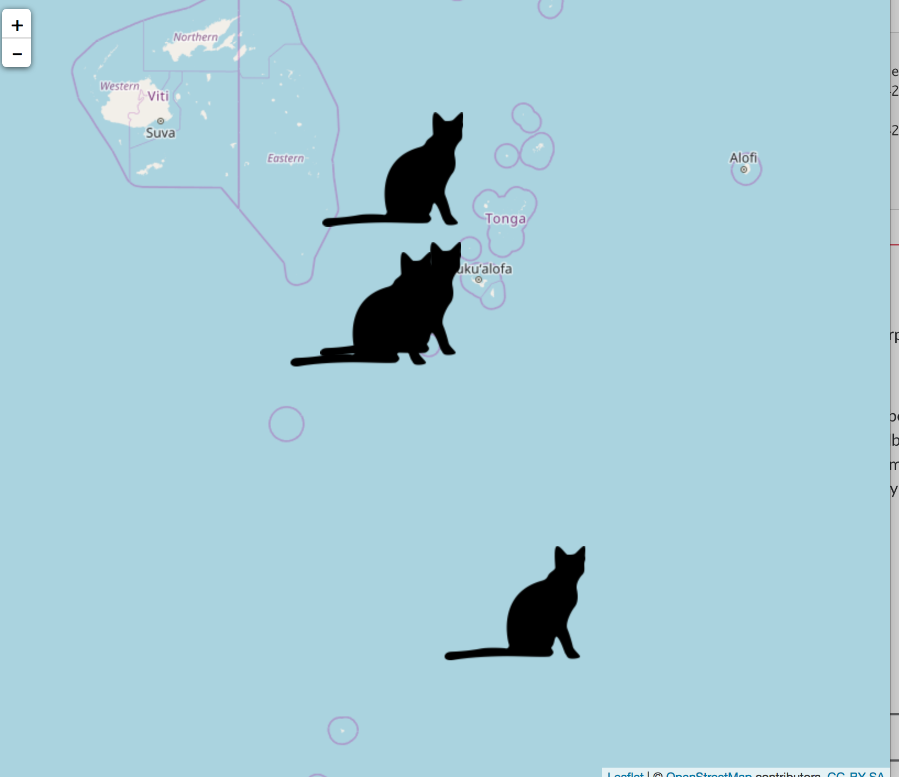

```{r echo=FALSE}
knitr::opts_chunk$set(
  fig.path = "man/figures/",
  comment = "#>",
  collapse = TRUE,
  warning = FALSE,
  message = FALSE
)
```

# rphylopic 

[](https://www.repostatus.org/#active)
[](https://github.com/sckott/rphylopic/actions/)
[](https://codecov.io/github/sckott/rphylopic?branch=master)
[](https://github.com/metacran/cranlogs.app)
[](https://cran.r-project.org/package=rphylopic)


The idea here is to create modular bits and pieces to allow you to add silhouettes to not only ggplot2 plots, but base plots as well.

+ Phylopic website: <http://phylopic.org/>
+ Phylopic development documentation: <http://phylopic.org/api/>

## Install

CRAN version

```{r eval=FALSE}
install.packages("rphylopic")
```

Development version

```{r eval=FALSE}
install.packages("remotes")
remotes::install_github("sckott/rphylopic")
```

```{r}
library('rphylopic')
```

## Work with names

Find the taxa in Phylopic whose names match some text

```{r}
person <- name_search(text = "Homo sapiens", options = "namebankID")[[1]]
```

Get info on a name

```{r}
# no options just returns the UUID (aka: self)
name_get(uuid = person$uid[1])
# specify fields to return with the `options` parameter
name_get(uuid = person$uid[1], options = c('citationStart', 'html'))
```

Searches for images for a taxonomic name.

```{r}
name_images(uuid = person$uid[1])
```

Find the minimal common supertaxa for a list of names.

```{r}
insect <- name_search('Orussus abietinus')[[1]]
bird <- name_search('Malacoptila panamensis')[[1]]
(x <- name_minsuptaxa(uuid = c(person$uid[1], insect$uid, bird$uid))[[1]])
name_get(x$canonicalName$uid, options = c('string'))
```

Collect taxonomic data for a name.

```{r}
name_taxonomy(uuid = "f3254fbd-284f-46c1-ae0f-685549a6a373", 
  options = "string", as = "list")
```

## Work with name sets

Retrieves information on a set of taxonomic names.

```{r}
id <- "8d9a9ea3-95cc-414d-1000-4b683ce04be2"
nameset_get(uuid = id, options = c('names', 'string'))
```

Collects taxonomic data for a name.

```{r}
nameset_taxonomy(uuid = "8d9a9ea3-95cc-414d-1000-4b683ce04be2", options = "string")$taxa[1:2]
```

## Work with images

Get info on an image

```{r}
id <- "9fae30cd-fb59-4a81-a39c-e1826a35f612"
image_get(uuid = id)
```

Count images in Phylopic database

```{r}
image_count()
```

Lists images in chronological order, from most to least recently modified

```{r}
image_list(start=1, length=2)
```

Lists images within a given time range, from most to least recent

```{r}
image_timerange(from="2013-05-11", to="2013-05-12", options='credit')[1:2]
```

## Work with uBio data

```{r}
ubio_get(namebankID = 109086)
```

## Plot a silhouette behind a plot

```{r tidy=FALSE}
library('ggplot2')
img <- image_data("27356f15-3cf8-47e8-ab41-71c6260b2724", size = "512")[[1]]
qplot(x = Sepal.Length, y = Sepal.Width, data = iris, geom = "point") +
  add_phylopic(img)
```

## Plot images as points in a plot

For `ggplot2` graphics...

```{r tidy=FALSE}
library('ggplot2')
img <- image_data("c089caae-43ef-4e4e-bf26-973dd4cb65c5", size = "64")[[1]]
p <- ggplot(mtcars, aes(drat, wt)) +
      geom_blank() +
      theme_grey(base_size = 18)
for (i in 1:nrow(mtcars)) {
  p <- p + add_phylopic(img, 1, mtcars$drat[i], mtcars$wt[i], ysize = 0.3)
}
p
```

and the same plot in base R graphics:

```{r tidy=FALSE}
cat <- image_data("23cd6aa4-9587-4a2e-8e26-de42885004c9", size = 128)[[1]]
posx <- runif(50, 0, 1)
posy <- runif(50, 0, 1)
size <- runif(50, 0.01, 0.2)
plot(posx, posy, type = "n", main = "A cat herd")
for (i in 1:50) {
  add_phylopic_base(cat, posx[i], posy[i], size[i])
}
```

## Save png to disk

```{r eval=FALSE}
cat <- image_data("23cd6aa4-9587-4a2e-8e26-de42885004c9", size = 128)[[1]]
out <- save_png(cat)
identical(png::readPNG(out), cat)
#> TRUE
```

## Use silhouettes as icons in Leaflet plots

There's nothing baked into `rphylopic` for this, but here's an example of how to do it.

```{r eval=FALSE}
library(leaflet)
data(quakes)

# get an image
cat <- image_data("23cd6aa4-9587-4a2e-8e26-de42885004c9", size = 128)[[1]]
# save to disk
file <- save_png(cat)
# make an icon. this one is super simple, see `makeIcon` docs for more options
sil_icon <- makeIcon(iconUrl = file)

# make the plot
leaflet(data = quakes[1:4,]) %>% addTiles() %>%
  addMarkers(~long, ~lat, icon = sil_icon)
```




## Meta

* Please [report any issues or bugs](https://github.com/sckott/rphylopic/issues).
* License: MIT
* Get citation information for `rphylopic` in R doing `citation(package = 'rphylopic')`
* Please note that this project is released with a [Contributor Code of Conduct][coc].
By participating in this project you agree to abide by its terms.

[coc]: https://github.com/sckott/rphylopic/blob/master/CODE_OF_CONDUCT.md
