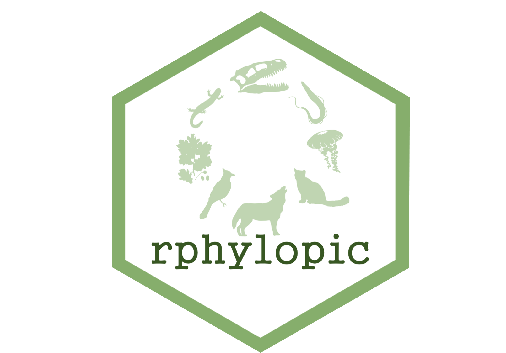

# rphylopic 

<!-- badges: start -->
[](https://github.com/palaeoverse-community/rphylopic/actions/workflows/R-CMD-check.yaml)
[](https://app.codecov.io/gh/palaeoverse-community/rphylopic)
[](https://CRAN.R-project.org/package=rphylopic)
[](https://cran.r-project.org/package=rphylopic)
[](https://twitter.com/ThePalaeoverse)
<!-- badges: end -->


The purpose of the `rphylopic` package is to allow users to add silhouettes of organisms to plots generated in base R and `ggplot2`. To do so, it uses silhouettes made available via the [PhyloPic website](http://phylopic.org/).

`rphylopic` was originally developed and maintained by [Scott Chamberlain](https://scottchamberlain.info). From ver. 1.0.0, the package is now developed and maintained by [William Gearty](https://williamgearty.com) and [Lewis A. Jones](https://www.lewisajones.com) from the [Palaeoverse team](https://palaeoverse.org).

## Installation

The stable version of `rphylopic` can be installed from CRAN using:

```r
install.packages("rphylopic")
```

The development version of `rphylopic` can be installed via GitHub using:

```r
# install.packages("devtools")
devtools::install_github("palaeoverse-community/rphylopic")
```

# How does it work?

## Get an image uuid

```r
# Load rphylopic
library(rphylopic)
# Get a single image uuid for a species
uuid <- get_uuid(name = "Canis lupus", n = 1)
# Or... as multiple silhouettes can exist per species
uuid <- get_uuid(name = "Canis lupus", n = 5)
```

## Pick an image

```r
# But if multiple images exist, how do I pick?!
# It's difficult without seeing the image itself, let's use:
img <- pick_phylopic(name = "Canis lupus", n = 5)
```

## Plot an image

### Base R

```r
# OK, now we've got the image we want... let's add it to a plot!
plot(x = 1, y = 1, type = "n")
add_phylopic_base(img = img, x = 1.25, y = 1.25, ysize = 0.25)

# But can't we just add an image straight away using the uuid? Sure!
uuid <- get_uuid(name = "Canis lupus", n = 1)
add_phylopic_base(uuid = uuid, x = 1, y = 1, ysize = 0.25)

# What about just using the first image linked to the name? Definitely!
add_phylopic_base(name = "Canis lupus", x = 0.75, y = 0.75, ysize = 0.25)

# Black is a bit boring? OK...
add_phylopic_base(name = "Canis lupus", x = 0.75, y = 1.25, ysize = 0.25, color = "orange")
```

### ggplot2

```r
# All of this functionality is available for ggplot2 as well...
# But we use add_phylopic instead!
library(ggplot2)
# Get image
img <- pick_phylopic(name = "Iris", n = 1)
# Put a silhouette behind a plot
ggplot(iris) +
  add_phylopic(img = img, color = "purple", alpha = .5) +
  geom_point(aes(x = Sepal.Length, y = Sepal.Width))
  
# Plot silhouettes as points!
p <- ggplot(iris) + 
  geom_point(aes(x = Sepal.Length, y = Sepal.Width), size = 0.1)
for (i in 1:nrow(iris)) {
  p <- p + add_phylopic(img = img,
                        x = iris$Sepal.Length[i],
                        y = iris$Sepal.Width[i],
                        ysize = 0.25,
                        color = "purple")
}
# Plot
p
```

## Get attribution

```r
# PhyloPic has a lot of contributors and we should acknowledge 
# their work. You can get data about images using get_attribution

# Get valid uuid
uuid <- get_uuid(name = "Cat")
# Get attribution data for uuid
get_attribution(uuid = uuid)
```

## Save an image

```r
# How do I save an image?
# Get image
img <- pick_phylopic(name = "Phascolarctos cinereus", n = 1)
# Save image
save_phylopic(img = img)
```

# How to contribute?

If you are interested in contributing to the `rphylopic` R package, you can do so by following these [guidelines](https://rphylopic.palaeoverse.org/CONTRIBUTING.html).

# Code of Conduct

As with any community project, society, or meeting we feel it is important to established some expectations of behaviour. Please read our [code of conduct](https://rphylopic.palaeoverse.org/CODE_OF_CONDUCT.html), and reach out if you ever face any issues. Everyone has the right to live and work in a harassment-free environment.

# Attribution

If you use the `rphylopic` package in your work, please acknowledge the contributors responsible for the image, the creator of PhyloPic--[Michael Keesey](http://tmkeesey.net)--and citing the following for `rphylopic`:

XXX

<p align="left">


</p>
