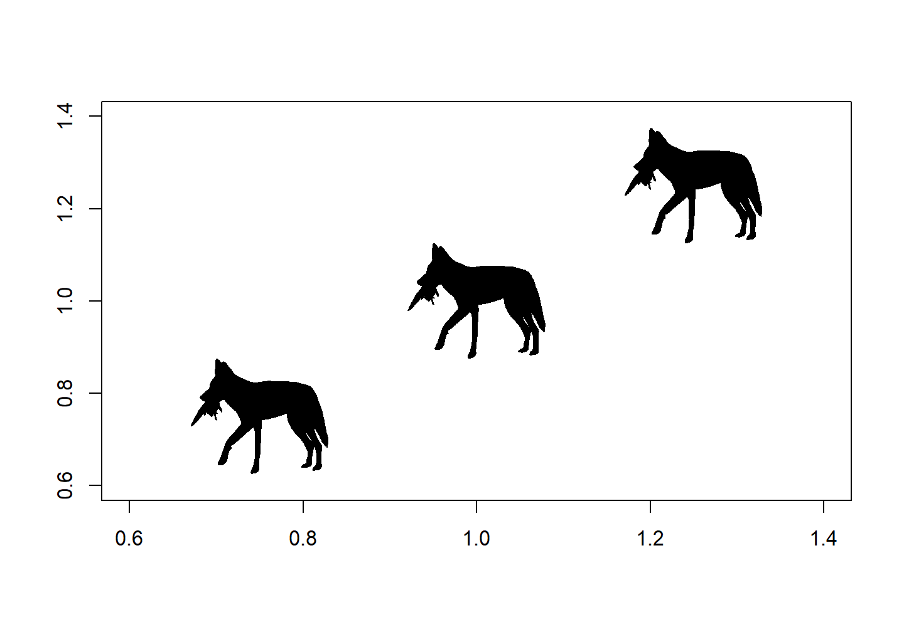
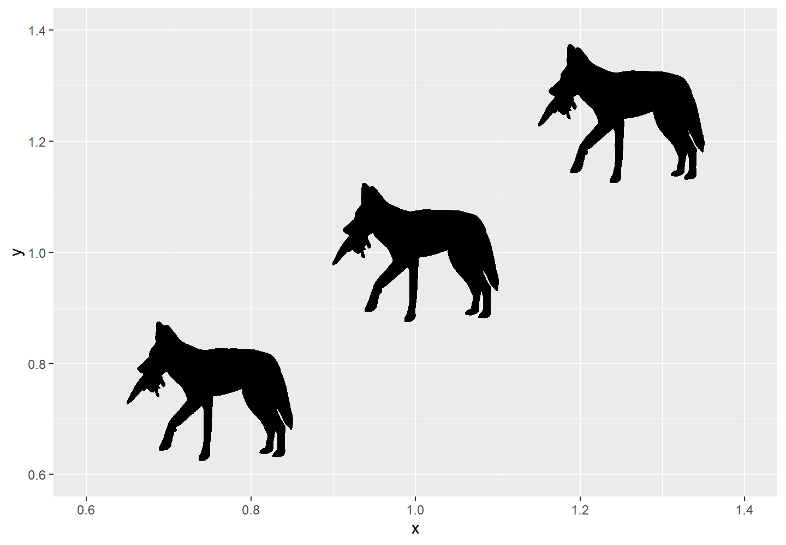
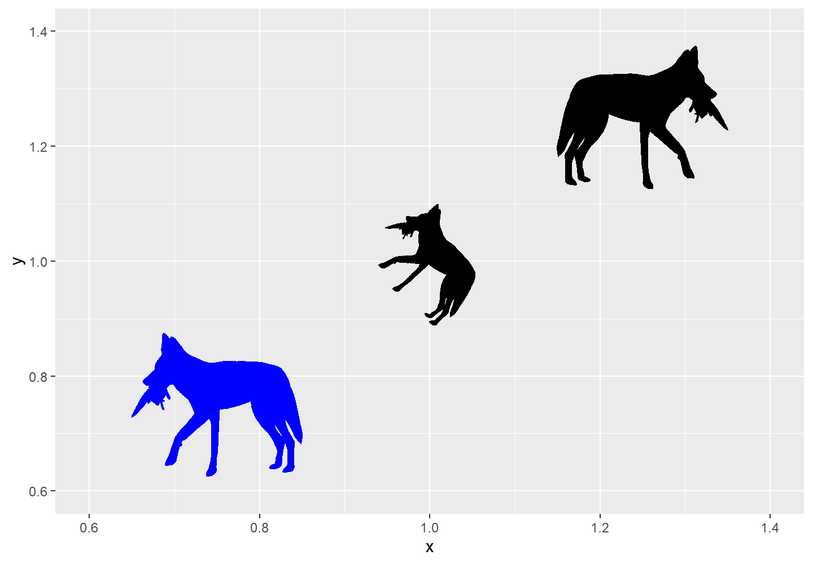

**Authors:** Lewis A. Jones & William Gearty

**Last updated:** 2023-11-16


<div style="text-align: justify">

# Introduction

**rphylopic** is a package that allows users to easily fetch and visualize silhouettes of organisms from [PhyloPic](https://www.phylopic.org). The package allows users to add silhouettes as layers or as data points to both base R and `{ggplot2}` plots. Additional functionality allows users to pick between available silhouettes, transform them (e.g., rotate and recolor), and save image files. This vignette will give you an overview of the package and provide example usage.

## Installation

The **rphylopic** package can be installed via CRAN or its dedicated [GitHub repository](https://github.com/palaeoverse-community/rphylopic) if the development version is preferred. To install via CRAN, simply use:


```r
install.packages("rphylopic")
```

To install the development version, first install the `{remotes}` package, and then use `install_github()` to install **rphylopic** directly from GitHub.


```r
install.packages("remotes")
remotes::install_github("palaeoverse-community/rphylopic")
```

You can now load **rphylopic** using the default `library()` function:


```r
library(rphylopic)
```

**Before we get onto the good stuff, the development team has a small request**. If you use **rphylopic** in your research, please cite the associated publication. This will help us to continue our work in supporting you to do yours. You can access the appropriate citation via:


```r
citation("rphylopic")
```

```
## To cite rphylopic in publications, use the following citation:
## 
##   Gearty, W. and Jones, L.A. 2023. rphylopic: An R package for fetching, transforming, and visualising PhyloPic silhouettes. Methods in
##   Ecology and Evolution, 14(11), 2700-2708. doi: 10.1111/2041-210X.14221.
## 
## A BibTeX entry for LaTeX users is
## 
##   @Article{,
##     title = {rphylopic: An R package for fetching, transforming, and visualising PhyloPic silhouettes},
##     author = {William Gearty and Lewis A. Jones},
##     year = {2023},
##     volume = {14},
##     number = {11},
##     pages = {2700-2708},
##     journal = {Methods in Ecology and Evolution},
##     doi = {10.1111/2041-210X.14221},
##   }
```

Also, don't forget to acknowledge the contributors of the silhouettes that you use (see [Get attribution]).

# How does it work?

Every silhouette available via [PhyloPic](https://www.phylopic.org) has a universally unique identifier (UUID). The first step to get a PhyloPic silhouette into R is to get a UUID. To do so via **rphylopic** you can use the `get_uuid()` function to search [PhyloPic](https://www.phylopic.org) based on a taxonomic or phylogenetic name (e.g., *Canis lupus* or pan-Mollusca) and return the first matched UUID. Using the returned UUID, you can then fetch the respective silhouette using `get_phylopic()`. However, multiple silhouettes (and hence UUIDs) can exist for a searched name. The `n` argument in `get_uuid()` allows you to fetch `n` matched UUIDs.

## Get an image uuid


```r
# Load rphylopic
library(rphylopic)
# Get a single image UUID for a species
uuid <- get_uuid(name = "Canis lupus")
# Get the image for that UUID
img <- get_phylopic(uuid = uuid)
# But multiple silhouettes can exist per species...
uuid <- get_uuid(name = "Canis lupus", n = 5)
```

## Pick an image

As multiple silhouettes can exist for a searched name, it can be difficult to pick the correct UUID, especially without visualizing the images. The `pick_phylopic()` function plots all requested silhouettes and provides an interactive menu to allow you to select the right image for you. Let's go with option 1!


```r
# How do I pick?!
# It's difficult without seeing the image itself, let's use:
img <- pick_phylopic(name = "Canis lupus", n = 4, view = 4)
```

## Plot an image

Now we have selected our silhouette, we can make some plots!

### Base R
Let's start with base R by using `add_phylopic_base()`:


```r
# OK, now we've got the image we want... let's add it to a plot!
plot(x = 1, y = 1, type = "n", ann = FALSE)
add_phylopic_base(img = img, x = 1.25, y = 1.25, ysize = 0.25)

# But can't we just add an image straight away using the UUID? Sure!
uuid <- get_uuid(name = "Canis lupus", n = 1)
add_phylopic_base(uuid = uuid, x = 1, y = 1, ysize = 0.25)

# What about just using the first image linked to the name? Definitely!
add_phylopic_base(name = "Canis lupus", x = 0.75, y = 0.75, ysize = 0.25)
```

<div class="figure">

<p class="caption">plot of chunk intro-base-plot</p>
</div>

Ah, you've found out our little secret! You can actually skip the steps of getting the UUID altogether by just searching for the desired taxon in `add_phylopic_base()`. However, this will always return the first matched silhouette meaning you might be missing out on all the other options! It's always worth checking out your options with `pick_phylopic()` first.

### ggplot2
You can also accomplish the same plot with the `{ggplot2}` package. Here, we'll use the `add_phylopic()` function, but the functionality and all of the arguments are the same:


```r
library(ggplot2)
p <- ggplot() +
  coord_cartesian(xlim = c(0.6, 1.4), ylim = c(0.6, 1.4)) +
  add_phylopic(img = img, x = 1.25, y = 1.25, ysize = 0.25)

# But can't we just add an image straight away using the UUID? Sure!
uuid <- get_uuid(name = "Canis lupus", n = 1)
p <- p + add_phylopic(uuid = uuid, x = 1, y = 1, ysize = 0.25)

# What about just using the first image linked to the name? Definitely!
p + add_phylopic(name = "Canis lupus", x = 0.75, y = 0.75, ysize = 0.25)
```

<div class="figure">

<p class="caption">plot of chunk intro-ggplot-plot</p>
</div>

## Transforming silhouettes
Once a silhouette is picked and saved in the your R environment, it may be useful to transform the image to better suit the particular visualization of interest. We have implemented three user-friendly functions to accommodate three transformations that might be desired: flipping, rotating, and recoloring.

The `flip_phylopic()` function can be used to flip a silhouette horizontally and/or vertically. This may be useful if, for example, you want all of the silhouettes to face the same direction.


```r
# Flip silhouette horizontally
img_flip <- flip_phylopic(img = img, horizontal = TRUE, vertical = FALSE)
```

The `rotate_phylopic()` function can be used to rotate a silhouette an arbitrary number of degrees. This may be useful when trying to align a silhouette with text or other objects within a figure.


```r
# Rotate silhouette by 45 degrees
img_rot <- rotate_phylopic(img = img, angle = 45)
```

Finally, the `recolor_phylopic()` function can be used to modify the fill color, outline color, and/or transparency of a silhouette. The vast majority of PhyloPic silhouettes are solid black, are fully opaque, and have a transparent outline by default. However, it may be useful to change this when the you are trying to either match an existing visualization color palette or trying to convey extra information, such as categorical data, through color.


```r
# Change fill color to blue and transparency to 50%
img_col <- recolor_phylopic(img = img, alpha = 0.5, fill = "blue")
```

Let's see what those look like in the same plot:


```r
ggplot() +
  coord_cartesian(xlim = c(0.6, 1.4), ylim = c(0.6, 1.4)) +
  add_phylopic(img = img_flip, x = 1.25, y = 1.25, ysize = 0.25) +
  add_phylopic(img = img_rot, x = 1, y = 1, ysize = 0.25) +
  add_phylopic(img = img_col, x = 0.75, y = 0.75, ysize = 0.25,
               fill = "original")
```

<div class="figure">

<p class="caption">plot of chunk intro-transform-plot</p>
</div>

You'll notice that the rotated silhouette is smaller than the other two silhouettes. This is because our functions have arguments to specify the height (`ysize`). The width is automatically set to maintain the original aspect ratio of the silhouette. In this case, the aspect ratio of the rotated silhouette has changed, so the same height results in a smaller silhouette overall.

For convenience, we have also included these transformation options within all of the visualization functions. The default fill is "black", hence why we needed to specify `fill = "original"` above. However, when the same transformed silhouette will be used for multiple visualizations, we suggest transforming the silhouette first, saving it as a new object, then using this new object for visualization purposes.

## Get attribution
Now that you've made a plot and used some silhouettes, you should acknowledge the contributors that made those silhouettes. Fortunately, **rphylopic** includes the `get_attribution()` function to get contributor data about specific images:


```r
# Get valid uuid
uuid <- get_uuid(name = "Nycticebus")
# Get attribution data for uuid
get_attribution(uuid = uuid)
```

```
## $contributor
## [1] "Mareike Janiak"
## 
## $contributor_uuid
## [1] "7bed68fb-cf59-4e58-aed1-41e81269fb01"
## 
## $created
## [1] "2020-05-19"
## 
## $contact
## character(0)
## 
## $image_uuid
## [1] "7f877a9e-53d7-48d0-a422-d3fa0ff5e2f9"
## 
## $license
## [1] "https://creativecommons.org/publicdomain/mark/1.0/"
## 
## $license_abbr
## [1] "Public Domain Mark 1.0"
```

This function can even write a little blurb for you to include in your publications:


```r
# Get valid uuid
uuid <- get_uuid(name = "Nycticebus")
# Get attribution data for uuid
get_attribution(uuid = uuid, text = TRUE)
```

```
## Organism silhouettes are from PhyloPic (https://www.phylopic.org/; T. Michael Keesey, 2023). Silhouette was contributed by Mareike Janiak, 2020 (Public Domain Mark 1.0).
```

## Save an image
You should be able to accomplish all of your visualization needs within R (see our other vignettes for examples), but in the rare case that need to use a silhouette outside of R, we've also got you covered with the `save_phylopic()` function. You can save silhouettes in a range of formats, including: Portable Document Format (PDF), Portable Network Graphics (PNG), Scale Vector Graphics (SVG), Tag Image File Format (TIFF), Joint Photographic Experts Group (JPEG), and bitmap (BMP).


```r
# How do I save an image?
# Get image
img <- pick_phylopic(name = "Phascolarctos cinereus", n = 1)
# Save image
save_phylopic(img = img)
```

## More advanced examples
Now that you've learned the ropes of **rphylopic**, how about you check out some more advanced examples?

- [Advanced examples in ggplot2](b-advanced-ggplot.html)
- [Advanced examples in base R](c-advanced-base.html)

</div>

<style type="text/css">
p.caption {
  display: none;
}
</style>
