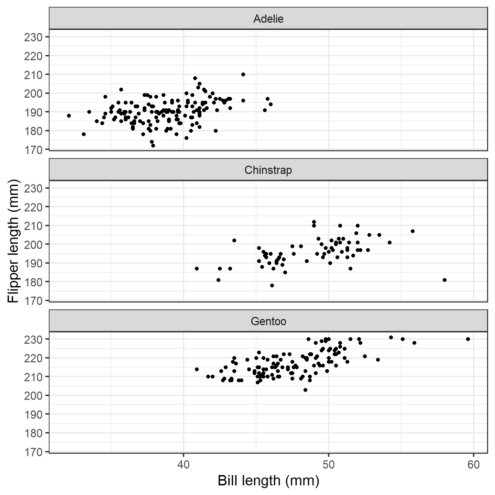
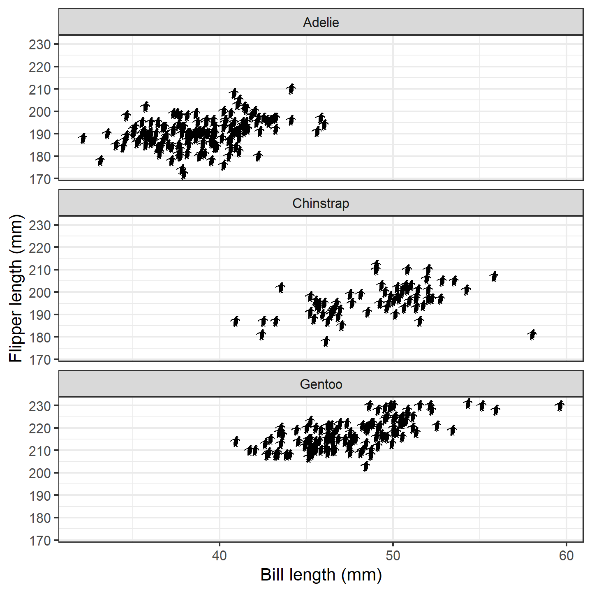
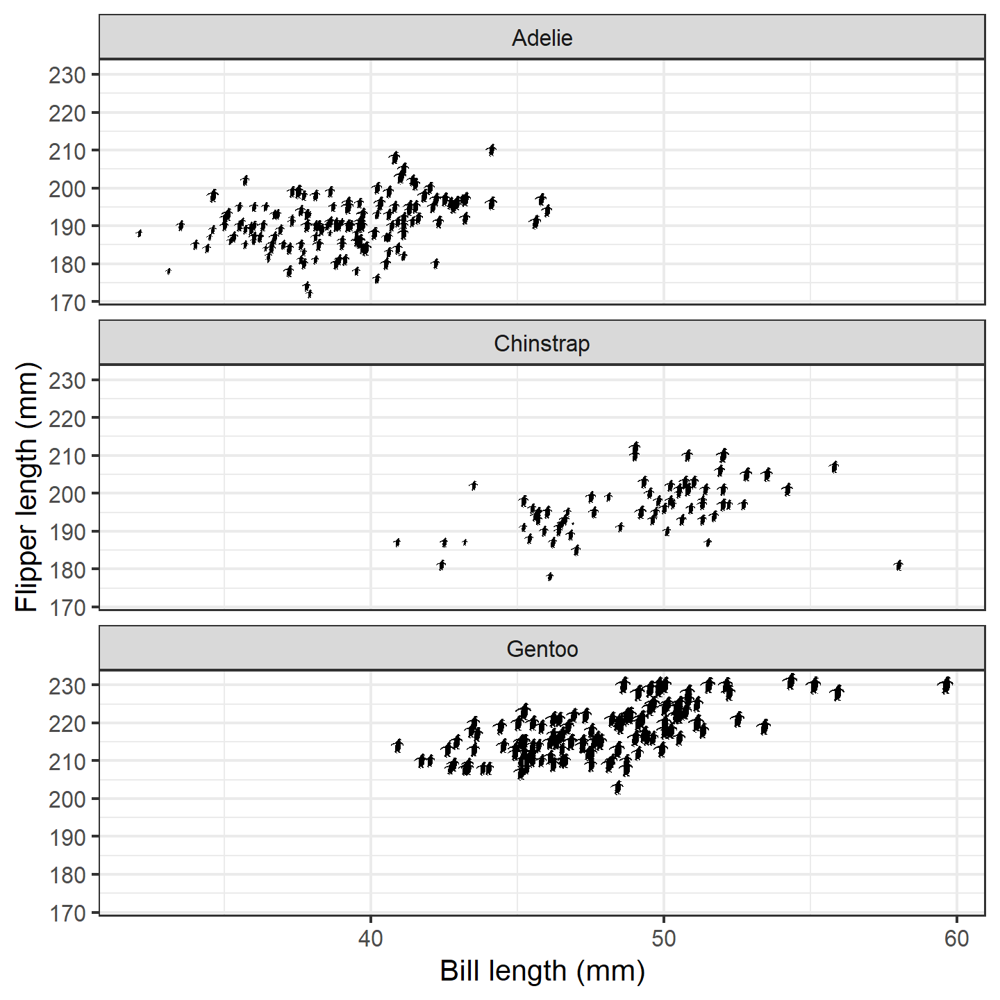
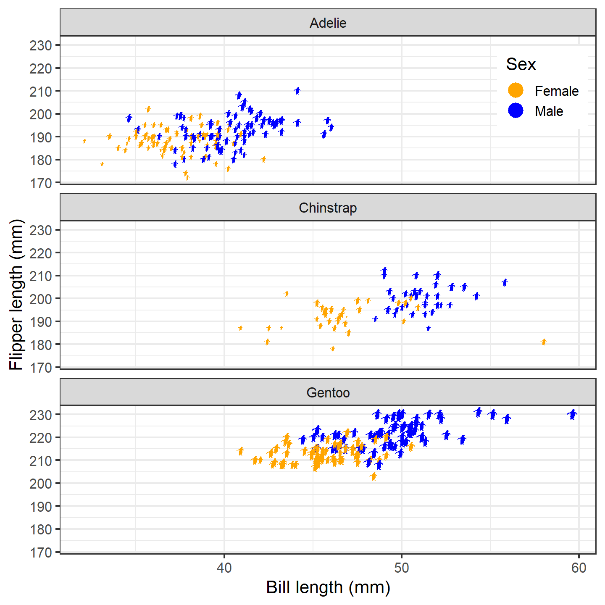
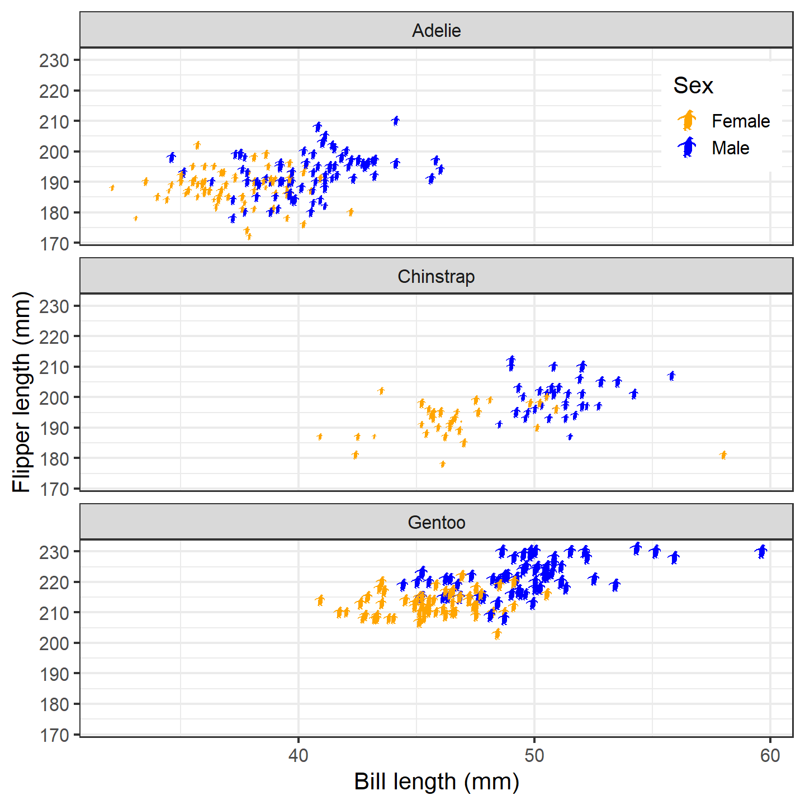
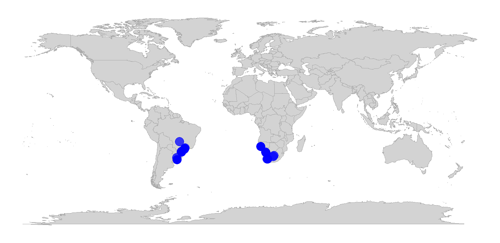
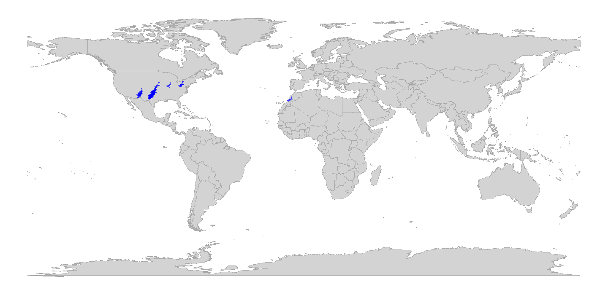
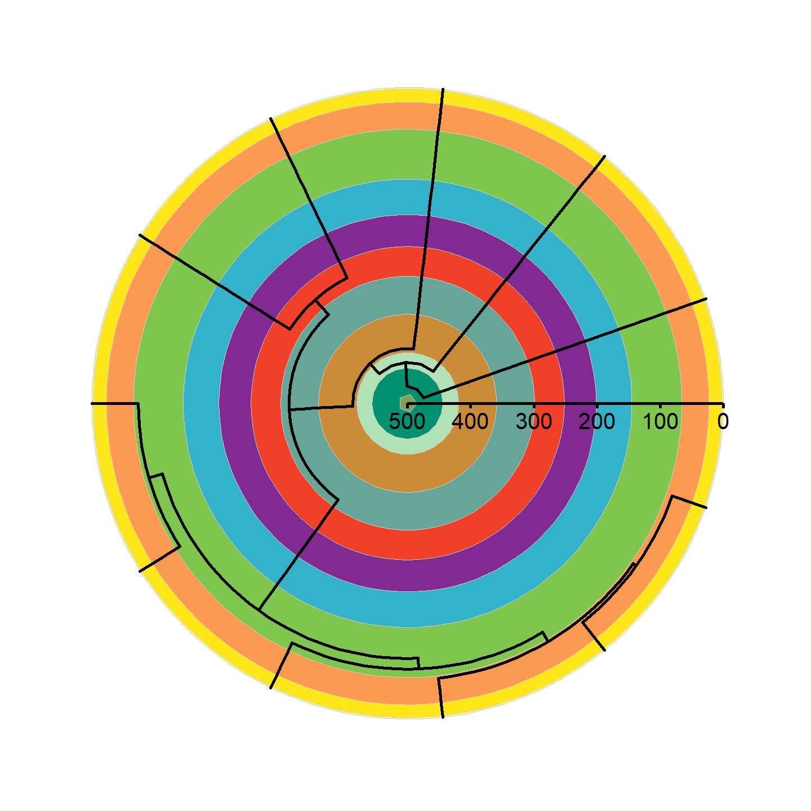
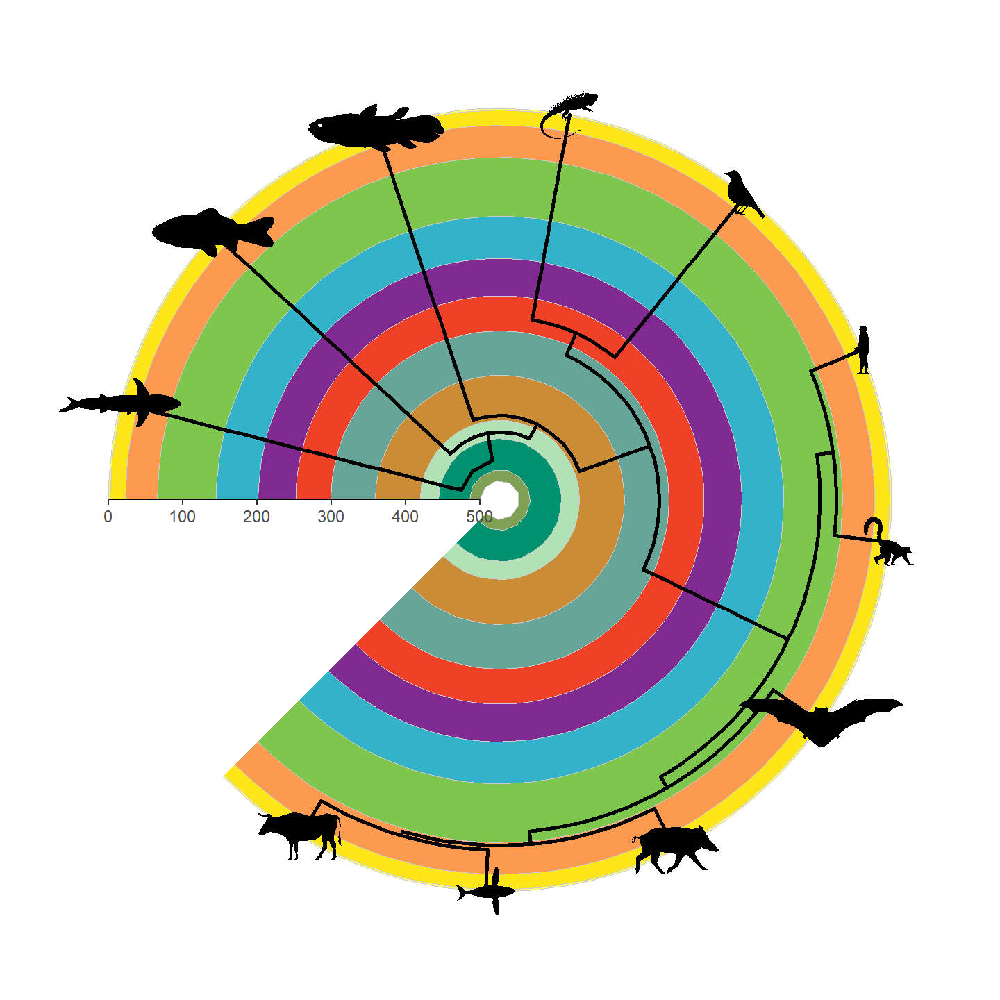

**Authors:** William Gearty & Lewis A. Jones

**Last updated:** 2023-11-09


<div style="text-align: justify">

# Introduction

Herein we provide three example applications of the **rphylopic** package in combination with the `{ggplot2}` package. However, note that all demonstrated functionality is also available for base R and showcased in a [separate vignette](c-advanced-base.html).

# Basic accession and transformation

The **rphylopic** package provides robust and flexible tools to access and transform PhyloPic silhouettes. Here we demonstrate this using the example dataset of Antarctic penguins from the `{palmerpenguins}` R package.

First, let's load our libraries and the penguin data:


```r
# Load libraries
library(rphylopic)
library(ggplot2)
library(palmerpenguins)
# Get penguin data and clean it
data(penguins)
penguins_subset <- subset(penguins, !is.na(sex))
```

Now, let's pick a silhouette to use for the penguins. Let's pick #2:


```r
# Pick a silhouette for Pygoscelis (here we pick #2)
penguin <- pick_phylopic("Pygoscelis", n = 3, view = 3)
```


You may have noticed in the preview that the silhouette was a little slanted. Let's rotate it clockwise just a smidgen:


```r
# It's a little slanted, so let's rotate it a little bit
penguin_rot <- rotate_phylopic(img = penguin, angle = 15)
```

Now, let's draft the plot that we want to make. In this case, let's plot the penguins' bill lengths vs. their flipper lengths:


```r
ggplot(penguins_subset) +
  geom_point(aes(x = bill_length_mm, y = flipper_length_mm)) +
  labs(x = "Bill length (mm)", y = "Flipper length (mm)") +
  facet_wrap(~species, ncol = 1) +
  theme_bw(base_size = 15)
```

<div class="figure">

<p class="caption">plot of chunk ggplot-penguin-plot-1</p>
</div>

That's a nice basic plot! But you know what would make it nicer? If we added a penguin silhouette to the plot. Sadly, we don't have a different silhouette for each species (although we could make one...), so let's just go with putting a single silhouette in the top panel. We'll use the `geom_phylopic()` function, which will require us to make a `data.frame`. Note that the `x` and `y` aesthetics specify the center of the silhouette, and the `size` argument specifies how tall the silhouette is in the units of the y-axis.


```r
silhouette_df <- data.frame(x = 59, y = 215, species = "Adelie")
ggplot(penguins_subset) +
  geom_point(aes(x = bill_length_mm, y = flipper_length_mm)) +
  geom_phylopic(data = silhouette_df, aes(x = x, y = y), size = 30,
                img = penguin_rot) +
  labs(x = "Bill length (mm)", y = "Flipper length (mm)") +
  facet_wrap(~species, ncol = 1) +
  theme_bw(base_size = 15)
```

<div class="figure">

<p class="caption">plot of chunk ggplot-penguin-plot-2</p>
</div>

Isn't that nifty! We can go a step further, though. What if we used little penguins instead of points?! To do that, we can use the `geom_phylopic()` function instead of the `geom_point()` function (in this case, we want to use the same image for each x-y pair):


```r
ggplot(penguins_subset) +
  geom_phylopic(img = penguin_rot,
                aes(x = bill_length_mm, y = flipper_length_mm)) +
  labs(x = "Bill length (mm)", y = "Flipper length (mm)") +
  facet_wrap(~species, ncol = 1) +
  theme_bw(base_size = 15)
```

<div class="figure">

<p class="caption">plot of chunk ggplot-penguin-plot-3</p>
</div>

The default silhouette size for `geom_phylopic()` is 1.5 which appears to work well given the range of the y-axis here. However, we can also vary the size based on some other aspect of data. In this case, let's try making the size of the silhouettes relative to the penguins' body masses. `{ggplot2}` should work its magic and make them reasonable sizes for the plot:


```r
ggplot(penguins_subset) +
  geom_phylopic(img = penguin_rot,
                aes(x = bill_length_mm, y = flipper_length_mm,
                    size = body_mass_g)) +
  labs(x = "Bill length (mm)", y = "Flipper length (mm)") +
  facet_wrap(~species, ncol = 1) +
  theme_bw(base_size = 15)
```

<div class="figure">

<p class="caption">plot of chunk ggplot-penguin-plot-4</p>
</div>

Finally, let's color the female and male penguins with different colors. Note that the default for `geom_phylopic()` is to not display a legend, so we need to set `show.legend = TRUE`. However, we only want a legend for the colors, so we use `guide = "none"` for the size scale:


```r
ggplot(penguins_subset) +
  geom_phylopic(img = penguin_rot,
                aes(x = bill_length_mm, y = flipper_length_mm,
                    size = body_mass_g, color = sex),
                show.legend = TRUE) +
  labs(x = "Bill length (mm)", y = "Flipper length (mm)") +
  scale_size_continuous(guide = "none") +
  scale_color_manual("Sex", values = c("orange", "blue"),
                     labels = c("Female", "Male")) +
  facet_wrap(~species, ncol = 1) +
  theme_bw(base_size = 15) +
  theme(legend.position = c(0.9, 0.9))
```

<div class="figure">

<p class="caption">plot of chunk ggplot-penguin-plot-5</p>
</div>

Hmm...the colored dots in the legend are great, but lucky for us, the package also supplies a convenient way to include silhouettes in the legend. Due to technical constraints, you'll need to specify the images/uuids/names again within `phylopic_key_glyph()`. If you supply more than one silhouette to this function, it will cycle through them as it generates legend keys (recycling as needed). Note that `phylopic_key_glyph()` does not currently support the size aesthetic.


```r
ggplot(penguins_subset) +
  geom_phylopic(img = penguin_rot,
                aes(x = bill_length_mm, y = flipper_length_mm,
                    size = body_mass_g, color = sex),
                show.legend = TRUE,
                key_glyph = phylopic_key_glyph(img = penguin_rot)) +
  labs(x = "Bill length (mm)", y = "Flipper length (mm)") +
  scale_size_continuous(guide = "none") +
  scale_color_manual("Sex", values = c("orange", "blue"),
                     labels = c("Female", "Male")) +
  facet_wrap(~species, ncol = 1) +
  theme_bw(base_size = 15) +
  theme(legend.position = c(0.9, 0.9))
```

<div class="figure">

<p class="caption">plot of chunk ggplot-penguin-plot-6</p>
</div>

Now that's a nice figure!

# Geographic distribution
In much the same way as generic x-y plotting, the **rphylopic** package can be used in combination with `{ggplot2}` to plot organism silhouettes on a map. That is, to plot data points (e.g., species occurrences) as silhouettes. We provide an example here of how this might be achieved. For this application, we use the example occurrence dataset of early (Carboniferous to Early Triassic) tetrapods from the `{palaeoverse}` R package to visualize the geographic distribution of *Mesosaurus* fossils.

First, let's load our libraries and the tetrapod data:


```r
# Load libraries
library(rphylopic)
library(ggplot2)
library(palaeoverse)
# Get occurrence data
data(tetrapods)
```

Then we'll subset our occurrences to only those for *Mesosaurus*:


```r
# Subset to desired group
tetrapods <- subset(tetrapods, genus == "Mesosaurus")
```

Now, let's plot those occurrences on a world map. `{ggplot2}` and it's built-in function `map_data()` make this a breeze. Note that we use `alpha = 0.75` in case there are multiple occurrences in the same place. That way, the darker the color, the more occurrences in that geographic location.


```r
# Get map data
world <- map_data(map = "world")
# Make map
ggplot() +
  geom_polygon(data = world, aes(x = long, y = lat, group = group),
               fill = "lightgray", color = "darkgrey", linewidth = 0.1) +
  geom_point(data = tetrapods, aes(x = lng, y = lat),
             size = 4, alpha = 0.75, color = "blue") +
  theme_void() +
  coord_sf()
```

<div class="figure">

<p class="caption">plot of chunk ggplot-geog-plot-1</p>
</div>

Now, as with the penguin figure above, we can easily replace those points with silhouettes.


```r
ggplot() +
  geom_polygon(data = world, aes(x = long, y = lat, group = group),
               fill = "lightgray", color = "darkgrey", linewidth = 0.1) +
  geom_phylopic(data = tetrapods, aes(x = lng, y = lat, name = genus),
                size = 4, alpha = 0.75, color = "blue") +
  theme_void() +
  coord_sf()
```

<div class="figure">

<p class="caption">plot of chunk ggplot-geog-plot-2</p>
</div>

Snazzy!

Note that while we used the genus name as the `name` aesthetic here, we easily could have done `name = "Mesosaurus"` outside of the `aes()` call instead. However, if we were plotting occurrences of multiple genera, we'd definitely want to plot them as different silhouettes using `name = genus` within the `aes()` call.

Also, note that we could change the projection of the map and data using the `crs` and `default_crs` arguments in `coord_sf()`. When projecting data, note that the y-axis limits will change to projected limits. For example, in the Robinson projection, the y-axis limits are roughly -8,600,000 and 8,600,000 in projected coordinates. Therefore, you may need to adjust the `size` argument/aesthetic accordingly when projecting maps and data.

# Phylogenetics
Another common use case of PhyloPic silhouettes is to represent taxonomic information. In this example, we demonstrate how to use silhouettes within a phylogenetic framework. In this case, the phylogeny, taken from the `{phytools}` package, includes taxa across all vertebrates. Even many taxonomic experts are unlikely to know the scientific names of these 11 disparate taxa, so we'll replace the names with PhyloPic silhouettes. First, let's load our libraries and data:


```r
# Load libraries
library(rphylopic)
library(ggplot2)
library(phytools)
# Get vertebrate phylogeny and data
data(vertebrate.tree)
```

We can use a vectorized version of the `get_uuid()` function to retrieve UUID values for all of the species at once. However, just in case we get an error, we wrap the `get_uuid()` call in a `tryCatch()` call. This way, we should get either a UUID or `NA` for each species: 


```r
# Make a data.frame for the PhyloPic names
vertebrate_data <- data.frame(species = vertebrate.tree$tip.label, uuid = NA)
# Try to get PhyloPic UUIDs for the species names
vertebrate_data$uuid <- sapply(vertebrate.tree$tip.label,
                               function(x) {
                                 tryCatch(get_uuid(x), error = function(e) NA)
                               })
vertebrate_data
```

```
##                   species                                 uuid
## 1  Carcharodon_carcharias 00f208a3-887d-4ae8-838c-2124f53b9fc1
## 2       Carassius_auratus b1995423-0170-4ff1-af49-1cdf692d8fc7
## 3     Latimeria_chalumnae 12c38a8a-6d68-4af3-ada3-05cafdfc25c2
## 4            Homo_sapiens 9c6af553-390c-4bdd-baeb-6992cbc540b1
## 5             Lemur_catta 8a187391-82a3-4d9b-a402-3a310bf7dc38
## 6        Myotis_lucifugus                                 <NA>
## 7              Sus_scrofa 3d8acaf6-4355-491e-8e86-4a411b53b98b
## 8  Megaptera_novaeangliae 012afb33-55c3-4fc6-9ae3-3a91fda32fd5
## 9              Bos_taurus dc5c561e-e030-444d-ba22-3d427b60e58a
## 10          Iguana_iguana 5dec03d9-66a2-4033-b1a9-6dbb3485199f
## 11     Turdus_migratorius 83b29bf0-f4f9-412d-8b3b-7faf4febd69d
```

Oh no, we weren't able to find a silhouette for *Myotis lucifugus* (little brown bat)! Good thing we used `tryCatch()`! Given the coarse resolution of this phylogeny, we can just grab a silhouette for the subfamily (Vespertilioninae):


```r
vertebrate_data$uuid[vertebrate_data$species == "Myotis_lucifugus"] <-
  get_uuid("Vespertilioninae")
```

I'm also not a huge fan of the boar picture. Let's choose an alternative with `pick_phylopic()`.


```r
# Pick a different boar image; we'll pick #2
boar_svg <- pick_phylopic("Sus scrofa", view = 5)
# Extract the UUID
vertebrate_data$uuid[vertebrate_data$species == "Sus_scrofa"] <-
  attr(boar_svg, "uuid")
```


Now that we've got our phylogeny and UUIDs, we could go ahead and create our figure. However, time for a quick aside. The time required for `geom_phylopic()` and the other **rphylopic** visualization functions scales with the number of *unique* names/UUIDs, not the number of plotted silhouettes. Therefore, if you are plotting a lot of *different* silhouettes, these functions can take quite a long time to poll PhyloPic for each unique name, download the silhouettes, and convert them to be added to the plot. If you plan to use the same silhouettes for multiple figures, we strongly suggest that you poll PhyloPic yourself using `get_phylopic()` or `pick_phylopic()`, save the silhouettes to your R environment, and then these use image objects in the visualization functions (with the `img` argument/aesthetic). Following this advice, let's get image objects for these 11 species before we make our figure. Note that, since we've used `get_uuid()` to get these 11 UUIDs, we know that they are valid, so we don't need to catch any errors this time.


```r
vertebrate_data$svg <- lapply(vertebrate_data$uuid, get_phylopic)
```

Now let's go ahead and plot our phylogeny with the [ggtree](https://www.bioconductor.org/packages/ggtree) package:


```r
library(ggtree)
# Plot the tree
ggtree(vertebrate.tree, size = 1, layout = "circular")
```

<div class="figure">

<p class="caption">plot of chunk ggplot-phylo-plot-1</p>
</div>

Hmm...that's a bit boring. Let's add a geological timescale to the background using `coord_geo_polar()` from the `{deeptime}` package. Note that we need to use the `revts()` function to reverse the time axis to work with `coord_geo_polar()`.


```r
library(deeptime)
# Plot the tree with a geological timescale in the background
revts(ggtree(vertebrate.tree, size = 1)) +
  scale_x_continuous(breaks = seq(-500, 0, 100),
                     labels = seq(500, 0, -100),
                     limits = c(-500, 0)) +
  coord_geo_polar(dat = "periods") +
  theme(line = element_line(linewidth = 1),
        axis.text.r = element_text(size = 5, hjust = -0.5, vjust = -1.5))
```

<div class="figure">

<p class="caption">plot of chunk ggplot-phylo-plot-2</p>
</div>

That's looking a lot prettier! Let's go ahead and add our silhouettes now. Note that we need to attach the `vertebrate_data` object with the `%<+%` operator from `{ggtree}`.


```r
revts(ggtree(vertebrate.tree, size = 1)) %<+% vertebrate_data +
  geom_phylopic(aes(img = svg), size = 25) +
  scale_x_continuous(breaks = seq(-500, 0, 100),
                     labels = seq(500, 0, -100),
                     limits = c(-500, 0)) +
  coord_geo_polar(dat = "periods") +
  theme(line = element_line(linewidth = 1),
        axis.text.r = element_text(size = 5, hjust = -0.5, vjust = -1.5))
```

<div class="figure">

<p class="caption">plot of chunk ggplot-phylo-plot-3</p>
</div>

Note that only a single size is specified and aspect ratio is always maintained, hence why the silhouettes all have the same height but different widths. Let's fix some of the silhouettes by rotating them 90 degrees:


```r
vertebrate_data$svg[[1]] <- rotate_phylopic(img = vertebrate_data$svg[[1]])
vertebrate_data$svg[[8]] <- rotate_phylopic(img = vertebrate_data$svg[[8]])
```

And now the finished product:


```r
revts(ggtree(vertebrate.tree, size = 1)) %<+% vertebrate_data +
  geom_phylopic(aes(img = svg), size = 25) +
  scale_x_continuous(breaks = seq(-500, 0, 100),
                     labels = seq(500, 0, -100),
                     limits = c(-500, 0)) +
  coord_geo_polar(dat = "periods") +
  theme(line = element_line(linewidth = 1),
        axis.text.r = element_text(size = 5, hjust = -0.5, vjust = -1.5))
```

<div class="figure">

<p class="caption">plot of chunk ggplot-phylo-plot-4</p>
</div>

Beautiful!

</div>

<style type="text/css">
p.caption {
  display: none;
}
</style>
