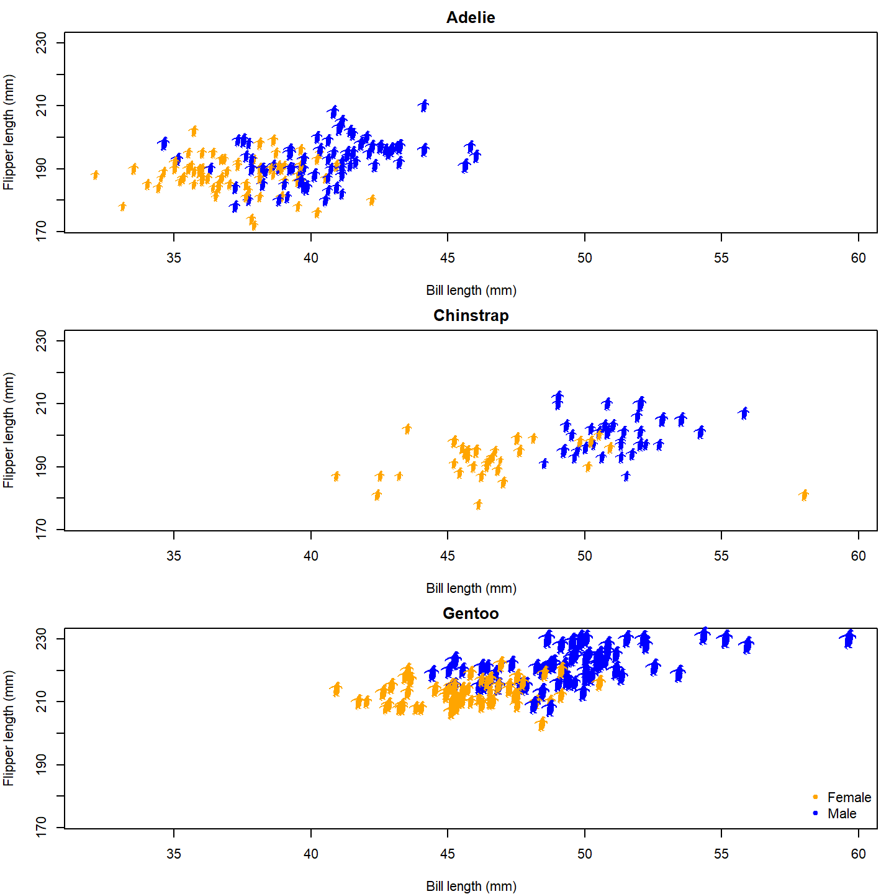
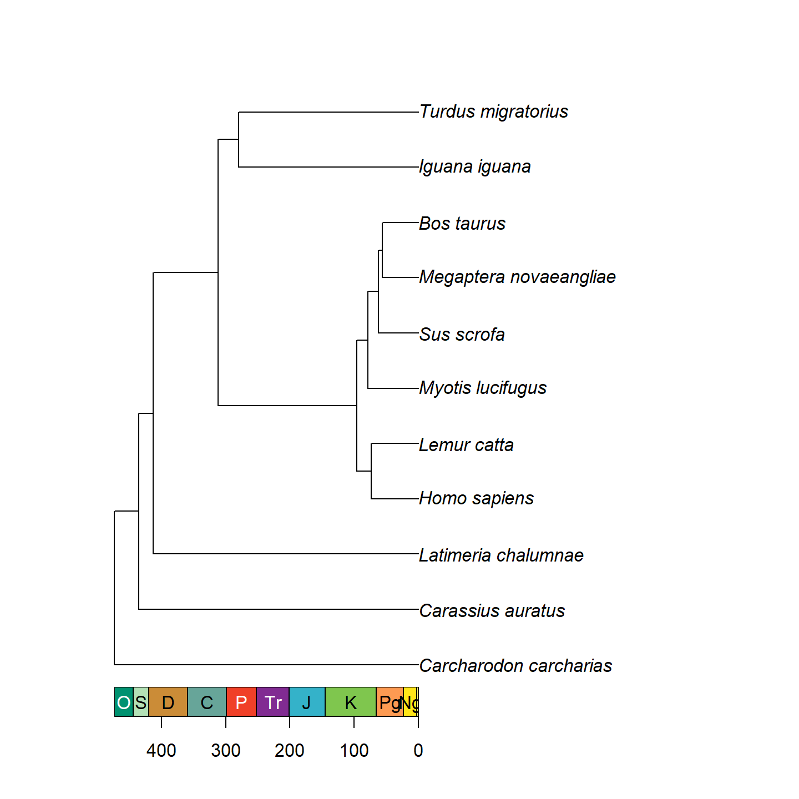
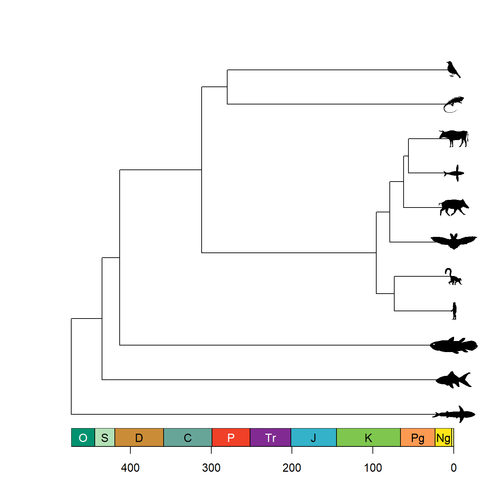

**Authors:** William Gearty & Lewis A. Jones

**Last updated:** 2023-10-28


<div style="text-align: justify">

# Introduction

Herein we provide three example applications of the **rphylopic** package using base R. However, note that all demonstrated functionality is also available for use with the `{ggplot2}` package and showcased in a [separate vignette](b-advanced-ggplot.html).

# Basic accession and transformation

The **rphylopic** package provides robust and flexible tools to access and transform PhyloPic silhouettes. Here we demonstrate this using the example dataset of Antarctic penguins from the `{palmerpenguins}` R package.

First, let's load our libraries and the penguin data:


```r
# Load libraries
library(rphylopic)
library(palmerpenguins)
# Get penguin data
data(penguins)
```

Now, let's pick a silhouette to use for the penguins. Let's pick #2:


```r
# Pick a silhouette for Pygoscelis (here we pick #2)
penguin <- pick_phylopic("Pygoscelis", n = 3, view = 3)
```


You may have noticed in the preview that the silhouette was a little slanted. Let's rotate it clockwise just a smidgen:


```r
# It's a little slanted, so let's rotate it a little bit
penguin_rot <- rotate_phylopic(img = penguin, angle = 15)
```

Now, let's clean the data and split the data among the three species:


```r
# Subset the data to remove rows with missing sex values
penguins_subset <- subset(penguins, !is.na(sex))
# Split the data by species
species_split <- split(penguins_subset, penguins_subset$species)
```

Now we're going to make a three panel plot, one panel for each species. Within each panel, we'll plot the penguins' bill lengths vs. their flipper lengths:


```r
# Set up the plot area
par(mfrow = c(3, 1), mar = c(4, 4, 2, 1))

# Loop over the species and create a plot for each one
for (i in seq_along(species_split)) {
  species_data <- species_split[[i]]
  plot(x = species_data$bill_length_mm, y = species_data$flipper_length_mm,
       xlab = "Bill length (mm)", ylab = "Flipper length (mm)",
       main = names(species_split)[i],
       xlim = range(penguins_subset$bill_length_mm, na.rm = TRUE),
       ylim = range(penguins_subset$flipper_length_mm, na.rm = TRUE))
}
```

<div class="figure">

<p class="caption">plot of chunk base-penguin-plot-1</p>
</div>

That's a nice basic plot! But you know what would make it nicer? If we added a penguin silhouette to the plot. Sadly, we don't have a different silhouette for each species (although we could make one...), so let's just go with putting a single silhouette in the top panel. To do that, we can use the `add_phylopic_base()` function. Note that the `x` and `y` arguments specify the center of the silhouette, and the `ysize` argument specifies how tall the silhouette is in the units of the y-axis.


```r
# Set up the plot area
par(mfrow = c(3, 1), mar = c(4, 4, 2, 1))

# Loop over the species and create a plot for each one
for (i in seq_along(species_split)) {
  species_data <- species_split[[i]]
  plot(x = species_data$bill_length_mm, y = species_data$flipper_length_mm,
       xlab = "Bill length (mm)", ylab = "Flipper length (mm)",
       main = names(species_split)[i],
       xlim = range(penguins_subset$bill_length_mm, na.rm = TRUE),
       ylim = range(penguins_subset$flipper_length_mm, na.rm = TRUE))
  if (i == 1) add_phylopic_base(img = penguin_rot, x = 59, y = 215, ysize = 30)
}
```

<div class="figure">

<p class="caption">plot of chunk base-penguin-plot-2</p>
</div>

Isn't that nifty! We can go a step further, though. What if we used little penguins instead of points?! To do that, we can once again use the `add_phylopic_base()` function. In this case, we can again specify `img = penguin_rot` since we want to use the same image for each x-y pair:


```r
# Set up the plot area
par(mfrow = c(3, 1), mar = c(4, 4, 2, 1))

# Loop over the species and create a plot for each one
for (i in seq_along(species_split)) {
  species_data <- species_split[[i]]
  plot(NA, xlab = "Bill length (mm)", ylab = "Flipper length (mm)",
       main = names(species_split)[i],
       xlim = range(penguins_subset$bill_length_mm, na.rm = TRUE),
       ylim = range(penguins_subset$flipper_length_mm, na.rm = TRUE))
  add_phylopic_base(img = penguin_rot,
                    x = species_data$bill_length_mm,
                    y = species_data$flipper_length_mm)
}
```

<div class="figure">

<p class="caption">plot of chunk base-penguin-plot-3</p>
</div>

Oh no, the silhouettes are way too big! The default for `add_phylopic_base()` is to make the silhouette the same height as the plot, which is way too big for our case here. Let's make the size of the silhouettes relative to the penguins' body masses. A scaling factor of 8 seems to work well for this size figure.


```r
par(mfrow = c(3, 1), mar = c(4, 4, 2, 1))

for (i in seq_along(species_split)) {
  species_data <- species_split[[i]]
  plot(NA, xlab = "Bill length (mm)", ylab = "Flipper length (mm)",
       main = names(species_split)[i],
       xlim = range(penguins_subset$bill_length_mm, na.rm = TRUE),
       ylim = range(penguins_subset$flipper_length_mm, na.rm = TRUE))
  add_phylopic_base(img = penguin_rot,
                    x = species_data$bill_length_mm,
                    y = species_data$flipper_length_mm,
                    ysize = species_data$body_mass_g /
                      max(penguins_subset$body_mass_g, na.rm = TRUE) * 8)
}
```

<div class="figure">

<p class="caption">plot of chunk base-penguin-plot-4</p>
</div>

Finally, let's color the female and male penguins with different colors. We'll also add a legend to the last panel.


```r
par(mfrow = c(3, 1), mar = c(4, 4, 2, 1))

for (i in seq_along(species_split)) {
  species_data <- species_split[[i]]
  plot(NA, xlab = "Bill length (mm)", ylab = "Flipper length (mm)",
       main = names(species_split)[i],
       xlim = range(penguins_subset$bill_length_mm, na.rm = TRUE),
       ylim = range(penguins_subset$flipper_length_mm, na.rm = TRUE))
  add_phylopic_base(img = penguin_rot,
                    x = species_data$bill_length_mm,
                    y = species_data$flipper_length_mm,
                    ysize = species_data$body_mass_g /
                      max(penguins_subset$body_mass_g, na.rm = TRUE) * 8,
                    color = ifelse(species_data$sex == "male", "blue", "orange"))
}

# Add a legend to the last plot
legend("bottomright", legend = c("Female", "Male"), pch = 20,
       col = c("orange", "blue"), bty = "n")
```

<div class="figure">

<p class="caption">plot of chunk base-penguin-plot-5</p>
</div>

Now that's a nice figure!

# Geographic distribution
In much the same way as generic x-y plotting, the **rphylopic** package can be used in base R to plot organism silhouettes on a map. That is, to plot data points (e.g., species occurrences) as silhouettes. We provide an example here of how this might be achieved. For this application, we use the example occurrence dataset of early (Carboniferous to Early Triassic) tetrapods from the `{palaeoverse}` R package to visualize the geographic distribution of *Mesosaurus* fossils.

First, let's load our libraries and the tetrapod data:


```r
# Load libraries
library(rphylopic)
library(maps)
library(palaeoverse)
# Get occurrence data
data(tetrapods)
```

Then we'll subset our occurrences to only those for *Mesosaurus*:


```r
# Subset to desired group
tetrapods <- subset(tetrapods, genus == "Mesosaurus")
```

Now, let's plot those occurrences on a world map. Here we use the `{geodata}` and `{raster}` packages to generate the map. Then we add colored points on top of this. Note that we use `alpha = 0.75` in case there are multiple occurrences in the same place. That way, the darker the color, the more occurrences in that geographic location.


```r
# Plot map
map("world", col = "lightgrey", fill = TRUE)
# Plot points
points(x = tetrapods$lng, y = tetrapods$lat, cex = 2, pch = 16,
       col = rgb(red = 0, green = 0, blue = 1, alpha = 0.75))
```

<div class="figure">

<p class="caption">plot of chunk base-geog-plot-1</p>
</div>

Now, as with the penguin figure above, we can easily replace those points with silhouettes.


```r
map("world", col = "lightgrey", fill = TRUE)
add_phylopic_base(name = "Mesosaurus", x = tetrapods$lng, y = tetrapods$lat,
                  ysize = 8, color = "blue", alpha = 0.75)
```

<div class="figure">

<p class="caption">plot of chunk base-geog-plot-2</p>
</div>

Snazzy!

Note that we used the genus name as the `name` argument here. However, if we were plotting occurrences of multiple genera, we'd definitely want to plot them as different silhouettes using `name = tetrapods$genus`.

# Phylogenetics
Another common use case of PhyloPic silhouettes is to represent taxonomic information. In this example, we demonstrate how to use silhouettes within a phylogenetic framework. In this case, the phylogeny, taken from the `{phytools}` package, includes taxa across all vertebrates. Even many taxonomic experts are unlikely to know the scientific names of these 11 disparate taxa, so we'll replace the names with PhyloPic silhouettes. First, let's load our libraries and data:


```r
# Load libraries
library(rphylopic)
library(ggplot2)
library(phytools)
# Get vertebrate phylogeny and data
data(vertebrate.tree)
```

We can use a vectorized version of the `get_uuid()` function to retrieve UUID values for all of the species at once. However, just in case we get an error, we wrap the `get_uuid()` call in a `tryCatch()` call. This way, we should get either a UUID or `NA` for each species: 


```r
# Make a data.frame for the PhyloPic names
vertebrate_data <- data.frame(species = vertebrate.tree$tip.label, uuid = NA)
# Try to get PhyloPic UUIDs for the species names
vertebrate_data$uuid <- sapply(vertebrate.tree$tip.label,
                               function(x) {
                                 tryCatch(get_uuid(x), error = function(e) NA)
                               })
vertebrate_data
```

```
##                   species                                 uuid
## 1  Carcharodon_carcharias 00f208a3-887d-4ae8-838c-2124f53b9fc1
## 2       Carassius_auratus b1995423-0170-4ff1-af49-1cdf692d8fc7
## 3     Latimeria_chalumnae 12c38a8a-6d68-4af3-ada3-05cafdfc25c2
## 4            Homo_sapiens 9c6af553-390c-4bdd-baeb-6992cbc540b1
## 5             Lemur_catta 8a187391-82a3-4d9b-a402-3a310bf7dc38
## 6        Myotis_lucifugus                                 <NA>
## 7              Sus_scrofa 3d8acaf6-4355-491e-8e86-4a411b53b98b
## 8  Megaptera_novaeangliae 012afb33-55c3-4fc6-9ae3-3a91fda32fd5
## 9              Bos_taurus dc5c561e-e030-444d-ba22-3d427b60e58a
## 10          Iguana_iguana 5dec03d9-66a2-4033-b1a9-6dbb3485199f
## 11     Turdus_migratorius 83b29bf0-f4f9-412d-8b3b-7faf4febd69d
```

Oh no, we weren't able to find a silhouette for *Myotis lucifugus* (little brown bat)! Good thing we used `tryCatch()`! Given the coarse resolution of this phylogeny, we can just grab a silhouette for the subfamily (Vespertilioninae):


```r
vertebrate_data$uuid[vertebrate_data$species == "Myotis_lucifugus"] <-
  get_uuid("Vespertilioninae")
```

I'm also not a huge fan of the boar picture. Let's choose an alternative with `pick_phylopic()`.


```r
# Pick a different boar image; we'll pick #2
boar_svg <- pick_phylopic("Sus scrofa", view = 5)
# Extract the UUID
vertebrate_data$uuid[vertebrate_data$species == "Sus_scrofa"] <-
  attr(boar_svg, "uuid")
```


Now that we've got our phylogeny and UUIDs, we could go ahead and create our figure. However, time for a quick aside. The time required for `add_phylopic_base()` and the other **rphylopic** visualization functions scales with the number of *unique* names/UUIDs, not the number of plotted silhouettes. Therefore, if you are plotting a lot of *different* silhouettes, these functions can take quite a long time to poll PhyloPic for each unique name, download the silhouettes, and convert them to be added to the plot. If you plan to use the same silhouettes for multiple figures, we strongly suggest that you poll PhyloPic yourself using `get_phylopic()` or `pick_phylopic()`, save the silhouettes to your R environment, and then these use image objects in the visualization functions (with the `img` argument/aesthetic). Following this advice, let's get image objects for these 11 species before we make our figure. Note that, since we've used `get_uuid()` to get these 11 UUIDs, we know that they are valid, so we don't need to catch any errors this time.


```r
vertebrate_data$svg <- lapply(vertebrate_data$uuid, get_phylopic)
```

Now let's go ahead and plot our phylogeny with the `{ape}` package:


```r
library(ape)
# Plot the tree
plot(vertebrate.tree)
```

<div class="figure">

<p class="caption">plot of chunk base-phylo-plot-1</p>
</div>

Hmm...that's a bit boring. Let's add a geological timescale to the bottom using `axis_geo_phylo()` from the `{palaeoverse}` package.


```r
library(palaeoverse)
# Plot the tree with a geological timescale on the bottom
plot(vertebrate.tree)
axis_geo_phylo(intervals = "periods")
```

<div class="figure">

<p class="caption">plot of chunk base-phylo-plot-2</p>
</div>

That's looking a lot prettier! Let's go ahead and replace the tip labels with our silhouettes now using `add_phylopic_base()`. Note that while it may look like all of the tips have an x-axis value of 0, that's actually a trick from `axis_geo_phylo()`. In reality, the left end of the x-axis is 0, and the right end of the x-axis is the total height of the tree. We can calculate this using the `nodeHeights()` function.


```r
plot(vertebrate.tree, show.tip.label = FALSE)
axis_geo_phylo(intervals = "periods")
add_phylopic_base(img = vertebrate_data$svg,
                  x = max(nodeHeights(vertebrate.tree)), y = 1:11, ysize = 0.5)
```

<div class="figure">

<p class="caption">plot of chunk base-phylo-plot-3</p>
</div>

Note that only a single size is specified and aspect ratio is always maintained, hence why the silhouettes all have the same height but different widths. Let's fix some of the silhouettes by rotating them 90 degrees:


```r
vertebrate_data$svg[[1]] <- rotate_phylopic(img = vertebrate_data$svg[[1]])
vertebrate_data$svg[[8]] <- rotate_phylopic(img = vertebrate_data$svg[[8]])
```

And now the finished product:


```r
plot(vertebrate.tree, show.tip.label = FALSE)
axis_geo_phylo(intervals = "periods")
add_phylopic_base(img = vertebrate_data$svg,
                  x = max(nodeHeights(vertebrate.tree)), y = 1:11, ysize = 0.5)
```

<div class="figure">

<p class="caption">plot of chunk base-phylo-plot-4</p>
</div>

Beautiful!

</div>
